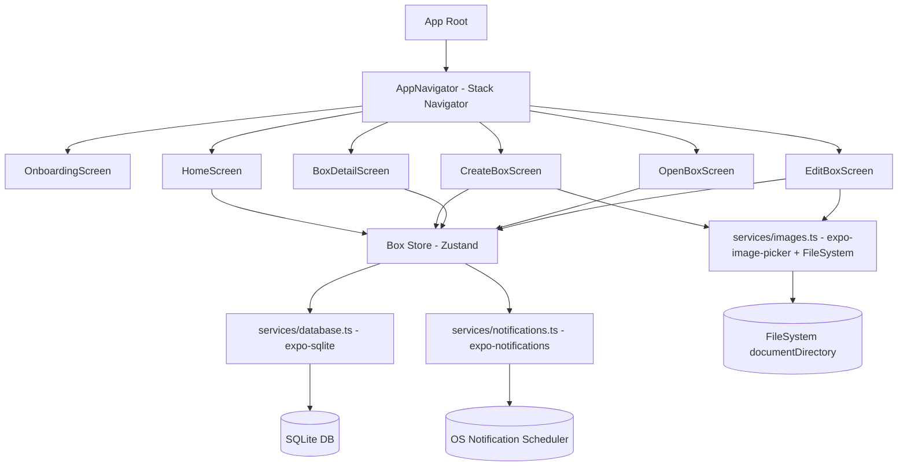

# System Architecture - FutureBoxes

## 1. Tổng quan

Ứng dụng React Native (Expo) thuần local, không có backend/API. Kiến trúc tập trung vào: navigation giữa các màn hình, lớp service truy cập SQLite/FileSystem/Notifications, và state management nhẹ cho danh sách hộp.

## 2. Component Diagram



## 3. Navigation Flow

| Screen | Vào từ | Ra đến |
|---|---|---|
| OnboardingScreen | Lần đầu mở app | Home (sau khi xin quyền notification) |
| HomeScreen | App launch / quay lại từ các màn hình khác | Create, Detail, Open |
| CreateBoxScreen | Home (FAB), Edit (giữ lại form khi sửa) | Home (sau khi lưu/hủy) |
| BoxDetailScreen | Home (tap box locked/opened) | Home, Edit (nếu can_edit), Open (nếu ready) |
| OpenBoxScreen | Home/Detail (tap box ready) | Home (sau khi hoàn tất) |
| EditBoxScreen | BoxDetailScreen (nếu can_edit) | BoxDetailScreen |

## 4. State Management Strategy

- **Global store**: Zustand store (`useBoxStore`) chứa danh sách boxes (đã JOIN content/result), trạng thái loading, và các action: `loadBoxes`, `createBox`, `updateBox`, `deleteBox`, `openBox`
- **Derived state**: `status` (locked/ready/opened) và `canEdit` được tính bằng selector/helper function (`getBoxStatus(box)`, `canEditBox(box)`) tại thời điểm render - không lưu trong store để tránh lệch dữ liệu theo thời gian
- **Local component state**: form state trong CreateBoxScreen/EditBoxScreen dùng `useState`/`react-hook-form`, không đưa vào global store
- **Refresh trigger**: Home re-tính `status` mỗi khi screen focus (`useFocusEffect`) để cập nhật box "locked" → "ready" theo thời gian thực

## 5. Service Layer

| Service | Trách nhiệm | Thư viện |
|---|---|---|
| `services/database.ts` | CRUD boxes + bảng con, migration | `expo-sqlite` |
| `services/notifications.ts` | Xin quyền, lên lịch/hủy local notification | `expo-notifications` |
| `services/images.ts` | Pick ảnh, copy vào app storage, resize/compress | `expo-image-picker`, `expo-image-manipulator`, `expo-file-system` |
| `utils/boxStatus.ts` | Tính `status`, `canEdit`, đếm ngược | - |

## 6. Folder Structure (đề xuất)

```
src/
  components/        # BoxCard, CountdownBadge, ConfettiEffect, StarRating, ...
  screens/
    OnboardingScreen/
    HomeScreen/
    CreateBoxScreen/
    BoxDetailScreen/
    OpenBoxScreen/
    EditBoxScreen/
  navigation/
    AppNavigator.tsx
  services/
    database.ts
    notifications.ts
    images.ts
  store/
    useBoxStore.ts
  types/
    box.ts            # TypeScript interfaces: Box, BoxLetter, BoxGoal, BoxMemory, BoxDecision
  constants/
    validation.ts      # giới hạn ký tự, default follow-up question
    designTokens.ts
  utils/
    boxStatus.ts
    dateHelpers.ts
```

## 7. Ghi chú cho Implementation Phase

- Mỗi loại hộp có 1 form component riêng (`LetterForm`, `GoalForm`, `MemoryForm`, `DecisionForm`) dùng chung layout `CreateBoxScreen` - chọn loại trước, render form tương ứng
- `OpenBoxScreen` cũng render nội dung/kết quả khác nhau theo `type`, dùng chung animation mở khóa
- Notification permission request chỉ hỏi 1 lần ở Onboarding; nếu denied, lưu cờ để hiển thị banner nhắc 1 lần trên Home
