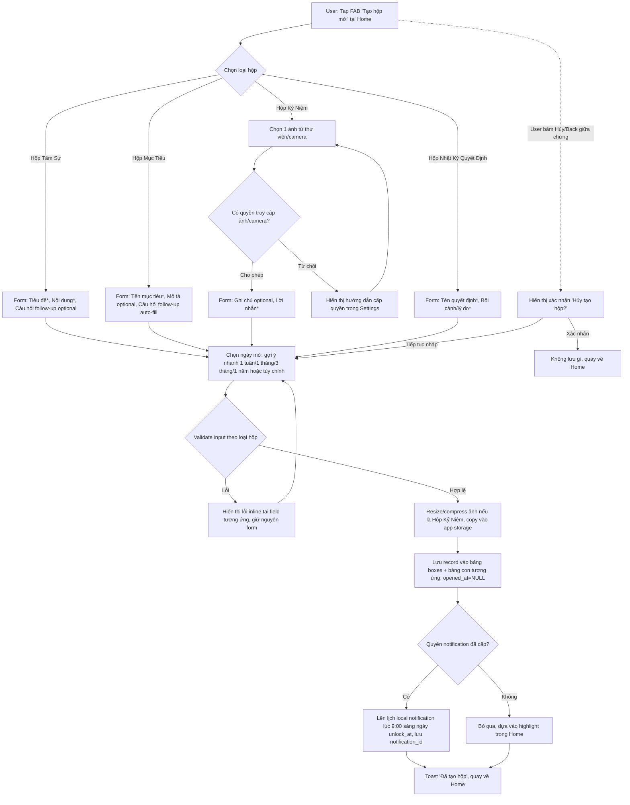

# Activity Diagram: Tạo hộp (F1-F4)

## Mô tả

Người dùng chọn loại hộp (Tâm Sự / Mục Tiêu / Kỷ Niệm / Quyết Định), điền form tương ứng, chọn ngày mở, sau đó hệ thống lưu hộp và lên lịch thông báo.

## Diagram

## Validation rules theo loại hộp

| Loại hộp | Field | Rule |
|---|---|---|
| Tâm Sự | Tiêu đề | bắt buộc, 1-100 ký tự |
| | Nội dung | bắt buộc, 1-1000 ký tự |
| | Câu hỏi follow-up | optional, 0-200 ký tự (mặc định "Mọi chuyện ổn chứ?" nếu trống) |
| Mục Tiêu | Tên mục tiêu | bắt buộc, 1-100 ký tự |
| | Mô tả | optional, 0-500 ký tự |
| | Câu hỏi follow-up | bắt buộc (auto-fill, editable), 1-200 ký tự |
| Kỷ Niệm | Ảnh | bắt buộc, đúng 1 ảnh |
| | Ghi chú | optional, 0-300 ký tự |
| | Lời nhắn | bắt buộc, 1-500 ký tự |
| Quyết Định | Tên quyết định | bắt buộc, 1-100 ký tự |
| | Bối cảnh/lý do | bắt buộc, 1-1000 ký tự |
| Tất cả | Ngày mở | bắt buộc, >= hôm nay + 1 ngày |

## Edge cases

- Người dùng từ chối quyền ảnh/camera → vẫn ở lại bước chọn ảnh, không cho tiếp tục đến khi có ảnh
- Resize/compress ảnh thất bại → hiển thị lỗi, cho phép chọn lại ảnh khác
- Quyền notification chưa cấp (denied ở Onboarding) → hộp vẫn được tạo bình thường, chỉ không có push notification
