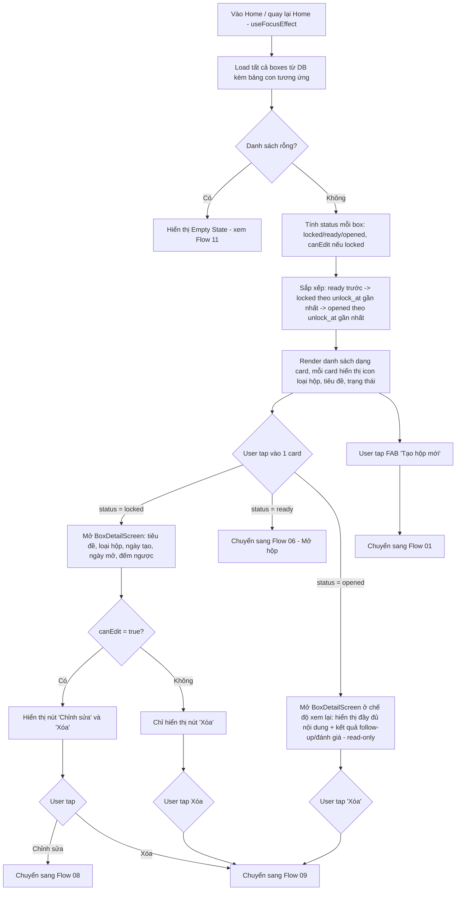

# Activity Diagram: Danh sách hộp - Home (F5)

## Mô tả

Màn hình chính hiển thị tất cả hộp, phân loại theo trạng thái tính toán (locked/ready/opened), cho phép điều hướng đến chi tiết, mở hộp hoặc tạo hộp mới.

## Diagram

## Card hiển thị theo trạng thái

| Trạng thái | Hiển thị |
|---|---|
| `locked` | Icon loại hộp, tiêu đề, đếm ngược (vd "Còn 5 ngày") |
| `ready` | Highlight nổi bật (badge "Sẵn sàng mở"), icon mở khóa |
| `opened` | Hiển thị mờ/nhạt hơn, icon đã mở |

## Edge cases

- Box vừa chuyển từ `locked` sang `ready` trong khi app đang mở → cập nhật lại khi Home được focus lại (không cần real-time polling)
- Lỗi đọc DB → hiển thị empty state kèm thông báo lỗi nhẹ, cho phép pull-to-refresh thử lại
