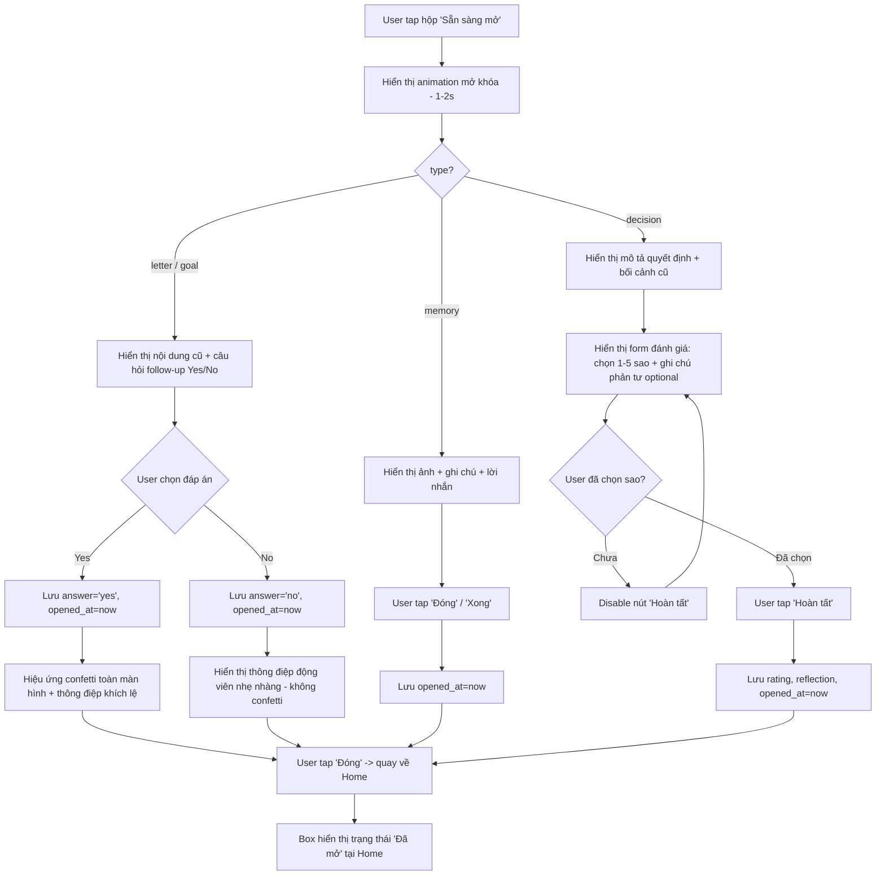

# Activity Diagram: Mở hộp & Hiệu ứng chúc mừng (F6-F7)

## Mô tả

Khi hộp ở trạng thái "Sẵn sàng mở", người dùng tap vào để xem animation mở khóa, sau đó xem nội dung và phản hồi (follow-up Yes/No hoặc đánh giá sao) tùy theo loại hộp.

## Diagram

## Quy tắc

- Sau khi `opened_at` được set, KHÔNG cho phép thay đổi `answer`/`rating`/`reflection` nữa (read-only vĩnh viễn)
- Hộp Kỷ Niệm (`memory`) không có bước phản hồi, chuyển `opened_at` ngay khi user xem xong
- Hộp Quyết Định (`decision`) bắt buộc chọn rating (1-5) trước khi hoàn tất; `reflection` là optional

## Edge cases

- User thoát giữa chừng (trước khi bấm Hoàn tất/Đóng) ở `letter`/`goal`/`decision` → KHÔNG lưu `opened_at`, hộp vẫn ở trạng thái "Sẵn sàng mở" để mở lại sau
- Hộp Kỷ Niệm: nếu file ảnh bị thiếu/lỗi (vd bị xóa khỏi storage ngoài ý muốn) → hiển thị placeholder ảnh lỗi, vẫn cho phép xem ghi chú/lời nhắn và đóng hộp bình thường
