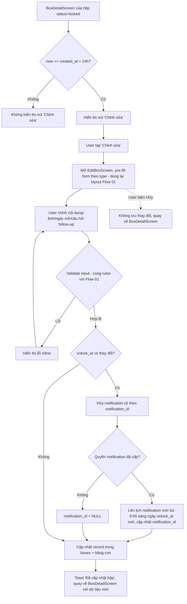

# Activity Diagram: Chỉnh sửa hộp trong 24h (F8)

## Mô tả

Trong vòng 24h kể từ `created_at`, hộp ở trạng thái `locked` cho phép chỉnh sửa toàn bộ field nội dung (trừ loại hộp). Nếu `unlock_at` thay đổi, lịch notification phải được cập nhật lại.

## Diagram

## Quy tắc

- KHÔNG cho phép đổi `type` của hộp khi chỉnh sửa
- Nếu hộp đã chuyển sang `ready` hoặc `opened` trước khi user kịp bấm "Chỉnh sửa" (quá 24h hoặc đã đến `unlock_at`) → nút "Chỉnh sửa" không hiển thị, chỉ còn "Xóa"
- Validation rules áp dụng giống hệt Flow 01 theo từng loại hộp

## Edge cases

- Hộp Kỷ Niệm: nếu user chọn ảnh mới → xóa file ảnh cũ khỏi storage sau khi lưu thành công ảnh mới
- `unlock_at` mới phải >= thời điểm sửa + 1 ngày (áp dụng rule giống Flow 01, tính từ "hiện tại" chứ không phải từ `created_at` gốc)
