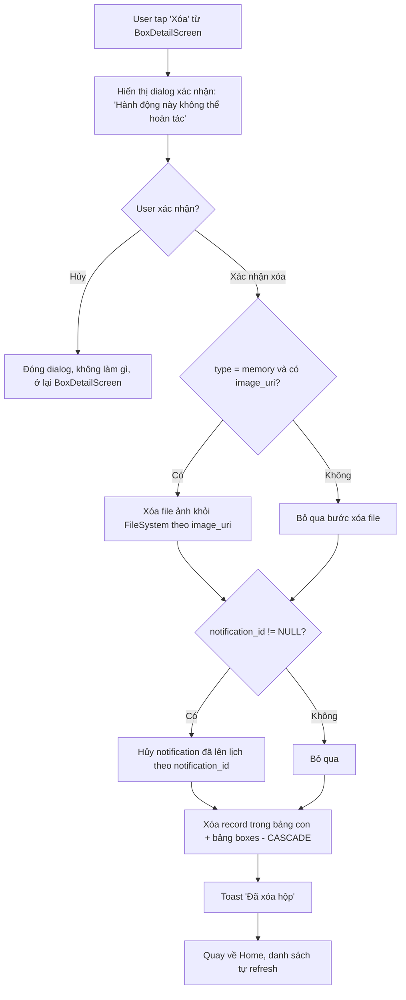

# Activity Diagram: Xóa hộp (F9)

## Mô tả

Cho phép xóa vĩnh viễn 1 hộp ở bất kỳ trạng thái nào (locked/ready/opened), kèm dọn dẹp file ảnh và notification đã lên lịch.

## Diagram

## Edge cases

- Xóa file ảnh thất bại (file không tồn tại) → bỏ qua lỗi, vẫn tiếp tục xóa record DB (không chặn thao tác xóa của user)
- Hủy notification thất bại (đã hết hạn/không tồn tại) → bỏ qua lỗi, vẫn tiếp tục xóa record DB
- Xóa hộp đang ở trạng thái `ready` → đồng thời đảm bảo notification (nếu chưa bắn) bị hủy để tránh hiển thị thông báo cho hộp không còn tồn tại
