# Activity Diagram: Thông báo đến hạn (F10)

## Mô tả

Quản lý vòng đời của local notification: xin quyền (Onboarding), lên lịch khi tạo/sửa hộp, hủy khi xóa/sửa, và đảm bảo notification vẫn tồn tại sau khi app/thiết bị restart.

## Diagram

```mermaid
flowchart TD
    subgraph Onboarding
        A[App khởi động lần đầu] --> B[Yêu cầu quyền notification]
        B --> C{User cho phép?}
        C -->|Có| D[Lưu permission=granted]
        C -->|Không| E[Lưu permission=denied]
        E --> F[Hiển thị banner nhắc bật quyền 1 lần ở Home]
    end

    subgraph "Tạo / Sửa hộp - Flow 01, 08"
        G[Hộp được tạo/cập nhật với unlock_at] --> H{permission=granted?}
        H -->|Có| I[Lên lịch local notification: trigger = ngày unlock_at lúc 9:00 sáng giờ địa phương]
        I --> J[Lưu notification_id vào record boxes]
        H -->|Không| K[notification_id=NULL, dựa vào highlight Home]
    end

    subgraph "Khi notification bắn"
        L[Đến đúng thời điểm đã lên lịch] --> M["Hệ thống hiển thị: 'Hộp [title] của bạn đã sẵn sàng để mở!'"]
        M --> N{User tap notification?}
        N -->|Có| O[Mở app, vào Home, box tương ứng hiển thị ở trạng thái ready]
        N -->|Không| P[Box vẫn hiển thị highlight 'Sẵn sàng mở' khi user tự mở app]
    end

    subgraph "App/thiết bị restart"
        Q[App khởi động lại] --> R[Query các boxes: opened_at IS NULL AND unlock_at trong tương lai]
        R --> S{notification_id còn hợp lệ?}
        S -->|Không/NULL và permission=granted| T[Lên lịch lại notification cho box đó]
        S -->|Có| U[Không cần làm gì]
    end
```

## Quy tắc

- Mỗi box chỉ có tối đa 1 notification đang active (1-1 qua `notification_id`)
- Banner nhắc bật quyền (khi `permission=denied`) chỉ hiển thị **1 lần** trên Home, sau đó không hiển thị lại (lưu cờ `hasShownNotificationBanner`)
- Notification trigger: 9:00 sáng giờ địa phương của `unlock_at`. Nếu `unlock_at` (00:00) đã qua 9:00 sáng tại thời điểm tạo (trường hợp hiếm vì `unlock_at >= now + 1 day`), trigger ngay thời điểm tạo + đủ thời gian hợp lệ

## Edge cases

- User cấp quyền sau khi đã từ chối (vào Settings bật thủ công) → app không tự phát hiện ngay; cần kiểm tra lại permission status mỗi khi Home được focus, nếu chuyển sang granted thì lên lịch bù cho các box chưa có `notification_id`
- Box đã `opened_at` nhưng notification chưa bắn (user mở sớm thủ công trước giờ 9:00) → hủy notification còn lại để tránh hiển thị thông báo thừa
