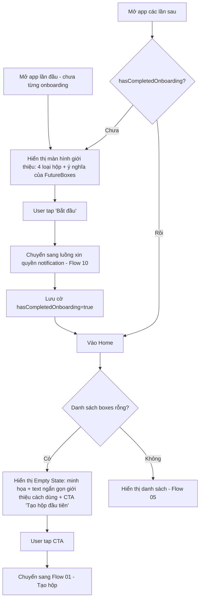

# Activity Diagram: Onboarding & Empty State (F11)

## Mô tả

Trải nghiệm lần đầu mở app: giới thiệu 4 loại hộp, xin quyền notification, sau đó vào Home. Nếu danh sách hộp rỗng (lần đầu hoặc đã xóa hết), hiển thị empty state với CTA tạo hộp đầu tiên.

## Diagram

## Quy tắc

- Onboarding chỉ hiển thị 1 lần duy nhất (lưu `hasCompletedOnboarding` trong AsyncStorage/SQLite settings)
- Empty State có thể xuất hiện lại bất kỳ lúc nào sau onboarding nếu user xóa hết tất cả hộp - không phụ thuộc vào `hasCompletedOnboarding`

## Edge cases

- User tap "Bắt đầu" nhưng thoát app trước khi hoàn tất xin quyền notification → khi mở lại app, tiếp tục từ bước xin quyền (chưa set `hasCompletedOnboarding=true`)
